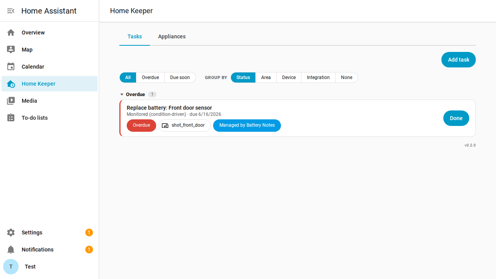
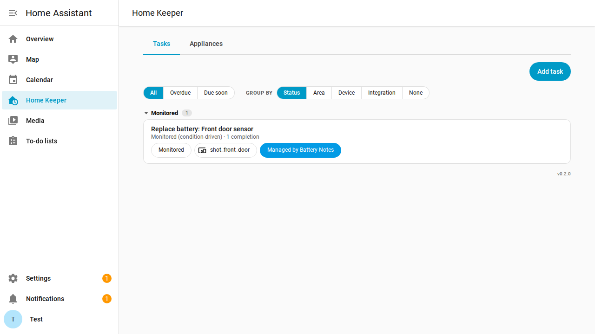

# Home Keeper — Battery Notes

A small glue integration that turns [Battery Notes](https://github.com/andrew-codechimp/HA-Battery-Notes)
signals into [Home Keeper](https://github.com/prestomation/ha-home-keeper) tasks — so
*"replace this battery"* shows up in your to-do list, on the device page, and in the
mobile app, and is recorded when you do it.

## What it does

- **Battery goes low** → a Home Keeper **"Replace battery: …"** task becomes **due now**
  on the same device, with a *"Managed by Battery Notes"* chip.
- **You replace it, from either side** → the two stay in sync (check the task off in Home
  Keeper, or press Battery Notes' *Battery Replaced* button / let the level recover).
- **Between low events the task is dormant** — it leaves the to-do list and calendar and
  sits in Home Keeper's collapsed **Monitored** section, so only batteries that actually
  need attention show as due, while replacement **history** accumulates on the task.

It uses Home Keeper's **`triggered`** (condition-driven) task type and is fully decoupled:
it talks to both integrations only over the event bus and services (with `has_service`
guards), so nothing breaks if one is missing.

> Screenshots are produced by the browser e2e tier driving the real stack, so they
> always reflect current behaviour.

## How it works

| Battery Notes signal | What the glue does |
|---|---|
| `battery_notes_battery_threshold` `battery_low: true` | create the task (born armed) if new, else `home_keeper.trigger_task` to re-arm |
| `battery_notes_battery_threshold` `battery_low: false` | `home_keeper.complete_task` (records the replacement, goes dormant) |
| `battery_notes_battery_replaced` | `home_keeper.complete_task` (idempotent) |
| `home_keeper_task_completed` (ours) | `battery_notes.set_battery_replaced` (two-way), with an `origin` guard so it never loops |

The glue is **stateless**: it re-derives everything from `home_keeper.list_tasks` (matched
by its `source` namespace) and Battery Notes' registry entities, and reconciles once on
start — so it self-heals across restarts and never creates duplicate tasks.

## Install

1. Install **Home Keeper** and **Battery Notes**.
2. Add this repo to HACS as a custom repository (category: Integration), install, restart.
3. Settings → Devices & Services → **Add Integration** → *Home Keeper — Battery Notes*.

### Options

- **Task name template** — default `Replace battery: {device_name}`.
- **Two-way sync** — completing in Home Keeper marks the battery replaced in Battery Notes (default on).
- **Clear on recovery** — clear the task if a battery's level recovers on its own (default on).
- **Skip rechargeable batteries** — don't raise replace-battery tasks for rechargeables (default **on**; see below).
- **Flag batteries that stop reporting** — also flag a battery that's gone silent (default **off**; see below).
- **Days with no report before flagging** — staleness threshold for the option above (default `3`).

## Rechargeable batteries

A phone or watch hitting a low charge means *plug it in*, not *replace the battery* — the
"low → replace" model is for **disposable** cells. A rechargeable cycles low→full
constantly, so a task for one churns forever (re-armed on every drain, cleared on every
charge) and logs phantom replacements; the only thing that would justify replacing it,
capacity degradation, is something Battery Notes can't see.

So **Skip rechargeable batteries** is **on by default**: a rechargeable (battery type
*Rechargeable*) going low or non-reporting raises no task, and a reconcile retires any
existing one — even after it's charged back up. Turn it off to track rechargeable
replacements by hand.

## Dead / non-reporting batteries

A *dead* battery usually just stops reporting (`unknown`/`unavailable`) rather than
crossing the low threshold, so by default it never becomes a task. Turn on **Flag
batteries that stop reporting** and the glue periodically asks Battery Notes which
batteries haven't reported in **N days** (`check_battery_last_reported`) and raises the
same task, noted *"not reporting for N days"*. The day threshold doubles as a debounce.
It's **off by default** because a silent device isn't always a dead battery.

## Development & tests

Three tiers (see `ci/`):

- **`ci/test-unit.sh`** — pure decision logic (`logic.py`), no Home Assistant required.
- **`ci/test-integration.sh`** — the glue against Home Keeper's real test fake in a HA runtime.
- **`ci/test-docker.sh`** — full end-to-end (REST): **real** Home Keeper + Battery Notes + this
  glue in a container. `ci/fetch-upstreams.sh` clones the upstreams (pin with `HK_REF` / `BN_REF`)
  and this tier also serves as the contract test for Battery Notes' event shapes.
- **`ci/e2e-up.sh`** — browser end-to-end: the same stack with the Home Keeper panel built, where
  Playwright asserts/screenshots the real panel. Refresh the images with
  `SHOT_DIR=docs/images CAPTURE=1 bash ci/e2e-up.sh`.

> **External contract note.** Battery Notes' event/field names are an external surface (see
> `const.py`), pinned and asserted by the Docker tier; if they change, update `const.py` and re-pin `BN_REF`.

## Design

The full design — why a persistent armed/dormant task (rather than create/delete per cycle)
and how it preserves history — lives in Home Keeper's
[`docs/BATTERY_NOTES_PLAN.md`](https://github.com/prestomation/ha-home-keeper/blob/main/docs/BATTERY_NOTES_PLAN.md)
and the contract in [`docs/INTEGRATING.md`](https://github.com/prestomation/ha-home-keeper/blob/main/docs/INTEGRATING.md) §7.
